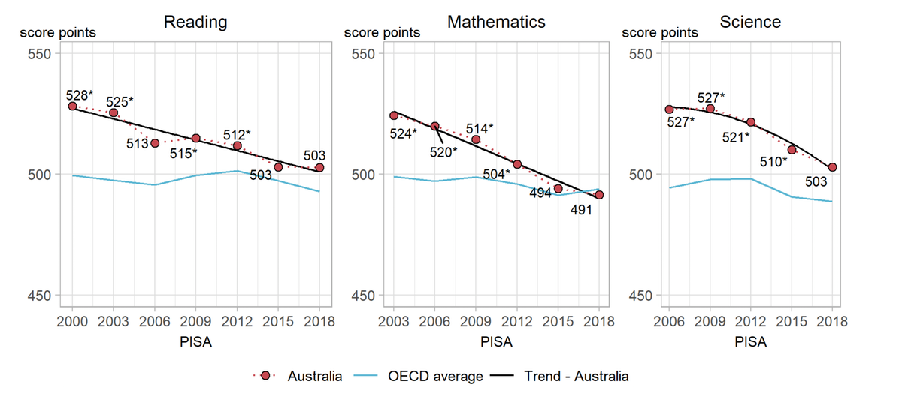

#  What is PISA? 


- The Organization for Economic Cooperation and Development [OECD](https://www.oecd.org/about/) is a global organization that aims to create better policies for better lives.

- [PISA](https://www.oecd.org/pisa/) is one of OECD's Programme for International Student Assessment.

- PISA assesses 15-year-old students' potential to apply their knowledge and abilities in reading, mathematics, and science to real-world challenges.

- The PISA test is primarily computer-based and lasts around 2 hours. The examination comprises both multiple choice and free entry questions.

- PISA assessment areas seek to measure the following aspects of students' literacy in math, reading, and science.


---

# What is `learningtower` ?

.pull-left[
- The learningtower package gives access to a subset of variables from PISA data originally collected and are available from OECD, for the years 2000 - 2018, collected on a three year basis.

- The learningtower package contains mainly three datasets:
  + `student`
  + `school`
  + `countrycode`

- This provides us with information about the students scores in mathematics, reading and science. Their school details, and which country they are from. Let’s have a look at how these datasets can be downloaded.

]

.pull-right[

```{r, out.width=460}
knitr::include_graphics("data/pisa_image.png")
```

]
---
#Student Dataset
.pull-left[
- The student dataset comprises of the scores from the triennial testing of 15-year-olds worldwide.

- Information on their parents qualifications, family wealth, gender, and possession of computers, internet, cars, books, rooms, desks, and similar other variables.

- The package only includes a portion of student data, called the student subset data, this subset of student data is available for all the years when the PISA experiment took place. The full year wise student data set can be downloaded using the `load_student()`

]


.pull-right[
- The student subsets can be downloaded as follows:

```{r, eval=FALSE, echo=TRUE}
data(student_subset_2018, package = "learningtower")
```


- The entire student data can be downloaded as follows:

```{r, eval=FALSE, echo=TRUE}
#load the entire student data for a single year
student_data_2018 <- load_student(2018)

#load the entire student data for two/three years (2000, 2012, 2018)
student_data_2012_2018 <- load_student(c(2012, 2018))
student_data_2000_2012_2018 <- load_student(c(2000, 2012, 2018))

#load the entire student data
student_data_all <- load_student("all")
```
]

---
#School and Country Datasets
.pull-left[
- The school dataset comprises school weight and other information such as the funding distribution of the schools, whether the school is private or public, the enrollment of boys and girls, the school size, and similar other characteristics of interest of different schools these 15-year-olds attend throughout the world.

- You can downlaoded the school dataset as follows:

```{r eval=FALSE, echo=TRUE}
data(school, package = "learningtower")
```
]

.pull-right[

- The countrycode dataset contains mapping of the country ISO code to the country name.

- You can downlaoded the countrycode dataset as follows:

```{r eval=FALSE, echo=TRUE}
data(countrycode, package = "learningtower")
```
]
---
#Research Questions
.pull-left[
- Is there any significant gender gaps between girls and boys across the world in the areas of mathematics, reading and science ?

- Do the different socioeconomic factors have a significant impact on the the students academic performance ?

- How did Australia perform in PISA ?

- Example analyses in the R Journal article
]

.pull-right[
```{r}

```
]

---
class: center, middle
.pull-left[
#Are girls smarter than boys?
]

.pull-right[
```{r}

```
]
---

```{r gendergap}

# Get the 2018 student data
if (!file.exists("data/student_2018.rda")) {
  student_2018 <- load_student("2018")
  save(student_2018, file = "data/student_2018.rda")
} else {
  load("data/student_2018.rda")
}
data(countrycode, package = "learningtower")

# Load the country names, and join
student_country <- left_join(student_2018,
                             countrycode, by = "country")

# Drop missing values
# math_pisa_2018_data <- student_country %>%
#   filter(!is.na(gender), !is.na(math), !is.na(stu_wgt))

pisa_2018_data_complete <- student_country %>%
  filter(!is.na(gender), !is.na(math), !is.na(stu_wgt))

# Compute average math scores and gender diff
if (!file.exists("data/math_diff_conf_intervals.rda")) {
math_diff_df <- pisa_2018_data_complete %>%
  group_by(gender, country_name) %>%
  summarise(avg = weighted.mean(math, stu_wgt),
            .groups = "drop") %>%
  ungroup() %>%
  pivot_wider(country_name,
              names_from = gender,
              values_from = avg) %>%
mutate(diff = female - male,
       country_name = fct_reorder(country_name, diff))

# Compute bootstrap samples
set.seed(2020)
boot_ests_math <- map_dfr(1:100, ~{
  pisa_2018_data_complete %>%
  group_by(country_name, gender) %>%
  sample_n(size = n(), replace = TRUE) %>%
  summarise(avg = weighted.mean(math, stu_wgt),
            .groups = "drop") %>%
  pivot_wider(country_name,
              names_from = gender,
              values_from = avg) %>%
  mutate(diff = female - male,
         country_name = fct_reorder(country_name, diff)) %>%
  mutate(boot_id = .x)
})

# Compute bootstrap confidence intervals
math_diff_conf_intervals <- boot_ests_math %>%
  group_by(country_name) %>%
  summarise(lower = sort(diff)[5],
            upper = sort(diff)[95],
            .groups = "drop") %>%
  left_join(math_diff_df, by = "country_name") %>%
  mutate(country_name = fct_reorder(country_name, diff)) %>%
  mutate(score_class = factor(case_when(
    lower < 0 & upper <= 0 ~ "boys",
    lower < 0 & upper >= 0 ~ "nodiff",
    lower >= 0 & upper > 0 ~ "girls"),
      levels = c("boys", "nodiff", "girls")))

  save(math_diff_conf_intervals,
       file="data/math_diff_conf_intervals.rda")

} else {
  load("data/math_diff_conf_intervals.rda")
}

# Plot math
math_plot <- ggplot(math_diff_conf_intervals,
                    aes(diff, country_name,
                        col = score_class)) +
  scale_colour_manual("",
      values = c("boys"="#3288bd",
                 "nodiff"="#969696",
                 "girls"="#f46d43")) +
  geom_point() +
  geom_errorbar(aes(xmin = lower, xmax = upper), width=0) +
  geom_vline(xintercept = 0, color = "#969696") +
  labs(y = "",
  x = "",
  title = "Math"
  ) +
  theme(legend.position="none") +
  annotate("text", x = 50, y = 1, label = "Girls") +
  annotate("text", x = -50, y = 1, label = "Boys") +
  scale_x_continuous(limits = c(-70, 70),
                     breaks = seq(-60, 60, 20),
                     labels = abs(seq(-60, 60, 20)))
```


```{r}
# Subset data and drop missing values
# read_pisa_2018_data <- student_country %>%
#   filter(!is.na(gender), !is.na(read), !is.na(stu_wgt))

# Compute average math scores and gender diff
if (!file.exists("data/read_diff_conf_intervals.rda")) {
read_diff_df <- pisa_2018_data_complete %>%
  group_by(gender, country_name) %>%
  summarise(avg = weighted.mean(read, stu_wgt),
            .groups = "drop") %>%
  ungroup() %>%
  pivot_wider(country_name, names_from = gender,
  values_from = avg) %>%
  mutate(diff = female - male,
  country_name = fct_reorder(country_name, diff))

# Compute bootstrap samples
boot_ests_read <- map_dfr(1:100, ~{
  pisa_2018_data_complete %>%
  group_by(country_name, gender) %>%
  sample_n(size = n(), replace = TRUE) %>%
  summarise(avg = weighted.mean(read, stu_wgt),
            .groups = "drop") %>%
  ungroup() %>%
  pivot_wider(country_name, names_from = gender, values_from = avg) %>%
  mutate(diff = female - male, country_name = fct_reorder(country_name, diff)) %>%
  mutate(boot_id = .x)
})

# Compute bootstrap confidence intervals
read_diff_conf_intervals <- boot_ests_read %>%
  group_by(country_name) %>%
  summarise(lower = sort(diff)[5],
            upper = sort(diff)[95],
            .groups = "drop")%>%
  left_join(read_diff_df, by = "country_name") %>%
  mutate(country_name = fct_reorder(country_name, diff)) %>%
  mutate(score_class = factor(case_when(
    lower < 0 & upper <= 0 ~ "boys",
    lower < 0 & upper >= 0 ~ "nodiff",
    lower >= 0 & upper > 0 ~ "girls"),
      levels = c("boys", "nodiff", "girls")))

  save(read_diff_conf_intervals,
       file="data/read_diff_conf_intervals.rda")

} else {
  load("data/read_diff_conf_intervals.rda")
}

read_plot <- ggplot(read_diff_conf_intervals,
                    aes(diff, country_name,
                        col = score_class)) +
  scale_colour_manual("",
      values = c("boys"="#3288bd",
                 "nodiff"="#969696",
                 "girls"="#f46d43")) +
  geom_point() +
  geom_errorbar(aes(xmin = lower, xmax = upper), width=0) +
  geom_vline(xintercept = 0, color = "#969696") +
  labs(y = "",
  x = "",
  title = "Reading"
  ) +
  theme(legend.position="none") +
  annotate("text", x = 50, y = 1, label = "Girls") +
  annotate("text", x = -50, y = 1, label = "Boys") +
  scale_x_continuous(limits = c(-70, 70),
                     breaks = seq(-60, 60, 20),
                     labels = abs(seq(-60, 60, 20)))
```


```{r}
# Subset data and drop missing values
# sci_pisa_2018_data <- student_country %>%
#   filter(!is.na(gender)) %>%
#   filter(!is.na(science)) %>%
#   filter(!is.na(stu_wgt))

# Compute average math scores and gender diff
if (!file.exists("data/sci_diff_conf_intervals.rda")) {
sci_diff_df <- pisa_2018_data_complete %>%
  group_by(gender, country_name) %>%
  summarise(avg = weighted.mean(science, stu_wgt),
            .groups = "drop") %>%
  ungroup() %>%
  pivot_wider(country_name, names_from = gender,
  values_from = avg) %>%
  mutate(diff = female - male,
  country_name = fct_reorder(country_name, diff))

# Compute bootstrap samples
boot_ests_sci <- map_dfr(1:100, ~{
  pisa_2018_data_complete %>%
  group_by(country_name, gender) %>%
  sample_n(size = n(), replace = TRUE) %>%
  summarise(avg = weighted.mean(science, stu_wgt),
    .groups = "drop") %>%
  ungroup() %>%
  pivot_wider(country_name,
              names_from = gender,
              values_from = avg) %>%
  mutate(diff = female - male, country_name = fct_reorder(country_name, diff)) %>%
  mutate(boot_id = .x)
})

# Compute bootstrap confidence intervals
sci_diff_conf_intervals <- boot_ests_sci %>%
  group_by(country_name) %>%
  summarise(
    lower = sort(diff)[5],
    upper = sort(diff)[95],
    .groups = "drop")%>%
  left_join(sci_diff_df, by = "country_name") %>%
  mutate(country_name = fct_reorder(country_name, diff)) %>%
  mutate(score_class = factor(case_when(
    lower < 0 & upper <= 0 ~ "boys",
    lower < 0 & upper >= 0 ~ "nodiff",
    lower >= 0 & upper > 0 ~ "girls"),
      levels = c("boys", "nodiff", "girls")))

  save(sci_diff_conf_intervals,
       file="data/sci_diff_conf_intervals.rda")

} else {
  load("data/sci_diff_conf_intervals.rda")
}


sci_plot <- ggplot(sci_diff_conf_intervals,
                    aes(diff, country_name,
                        col = score_class)) +
  scale_colour_manual("",
      values = c("boys"="#3288bd",
                 "nodiff"="#969696",
                 "girls"="#f46d43")) +
  geom_point() +
  geom_errorbar(aes(xmin = lower, xmax = upper), width=0) +
  geom_vline(xintercept = 0, color = "#969696") +
  labs(y = "",
  x = "",
  title = "Science"
  ) +
  theme(legend.position="none") +
  annotate("text", x = 50, y = 1, label = "Girls") +
  annotate("text", x = -50, y = 1, label = "Boys") +
  scale_x_continuous(limits = c(-70, 70),
                     breaks = seq(-60, 60, 20),
                     labels = abs(seq(-60, 60, 20)))
```

```{r score-differences, fig.cap ="Gender Gap Scores", fig.width=14, fig.height=9, fig.align='center'}
math_plot + read_plot + sci_plot
```
---


```{r}
theme_map <- function(...) {
  theme_minimal() +
  theme(
    text = element_text(),
    axis.line = element_blank(),
    axis.text.x = element_blank(),
    axis.text.y = element_blank(),
    axis.ticks = element_blank(),
    axis.title.x = element_blank(),
    axis.title.y = element_blank(),
    panel.border = element_blank(),
    panel.grid = element_blank()
  )
}

region2country = function(region_name){
  country_name = case_when(
    region_name == "Brunei Darussalam" ~ "Brunei",
    region_name == "United Kingdom" ~ "UK",
    region_name %in% c("Macau SAR China", "B-S-J-Z (China)",
                        "Hong Kong SAR China") ~ "China",
    region_name == "Korea" ~ "South Korea",
    region_name == "North Macedonia" ~ "Macedonia",
    region_name == "Baku (Azerbaijan)" ~ "Baku",
    region_name %in% c("Moscow Region (RUS)", "Tatarstan (RUS)",
                        "Russian Federation") ~ "Russia",
    region_name == "Slovak Republic" ~ "Slovakia",
    region_name == "Chinese Taipei" ~ "Taiwan",
    region_name == "United States" ~ "USA",
    TRUE ~ as.character(region_name))
}
```


```{r}
math_map_data <- math_diff_conf_intervals  %>%
  dplyr::mutate(country_name = region2country(region_name = country_name))

world_map <- map_data("world") %>%
  filter(region != "Antarctica") %>%
  fortify() %>%
  rename(country_name = region)

math_world_data <- full_join(
  x = math_map_data,
  y = world_map,
  by = "country_name") %>%
  rename(Country = country_name,
         Math = diff) %>%
  mutate(Math = round(Math, digits = 2))
```


```{r}
# Maps in R - Reading Maps
read_map_data <- read_diff_conf_intervals %>%
  dplyr::mutate(country_name = region2country(region_name = country_name))

world_map <- map_data("world") %>%
  filter(region != "Antarctica") %>%
  fortify() %>%
  rename(country_name = region)

read_world_data <- full_join(
  x = read_map_data,
  y = world_map,
  by = "country_name") %>%
  rename(Country = country_name,
         Reading = diff) %>%
  mutate(Reading = round(Reading, digits = 2))
```


```{r}
sci_map_data <- sci_diff_conf_intervals %>%
  dplyr::mutate(country_name = region2country(region_name = country_name))

world_map <- map_data("world") %>%
  filter(region != "Antarctica") %>%
  fortify() %>%
  rename(country_name = region)

sci_world_data <- full_join(
  x = sci_map_data,
  y = world_map,
  by = "country_name") %>%
  rename(Country = country_name,
         Science = diff)  %>%
  mutate(Science = round(Science, digits = 2))

math_dat <- math_world_data %>%
  dplyr::select(Country, Math, lat, long, group)

read_dat <- read_world_data %>%
  dplyr::select(Country, Reading, lat, long, group)

sci_dat <- sci_world_data %>%
  dplyr::select(Country, Science, lat, long, group)

math_read_dat <- left_join(math_dat,
                           read_dat,
                           by = c("Country","lat", "long", "group"))

math_read_sci_dat <- left_join(math_read_dat,
                           sci_dat,
                           by = c("Country","lat", "long", "group"))

math_read_sci_dat_wider <- math_read_sci_dat %>%
    pivot_longer(cols = c(2,6,7), names_to = "subjects")

mrs_maps <- ggplot(math_read_sci_dat_wider,
       aes(x = long,
           y = lat,
           group = group)) +
  geom_polygon(aes(fill= value,
                   label = Country)) +
  facet_wrap(~subjects, scales = "free", nrow = 3) +
  theme_map() +
  labs(title = "World Map displaying Gender Gap Scores in Math, Reading and Science")  +
  scale_fill_distiller(palette = "Spectral")
```


```{r plotly-maps, fig.cap="Maps", fig.align="center", out.width=650}
mrs_maps
```

---
class: center, middle
.pull-left[
#Impact of Socioeconomic Factors on Students' Performance
]
.pull-right[
```{r}

```

]
---
class: center, middle
.pull-left[
#Impact of Father's and Mother's Qualification on Students' Score
]

.pull-right[
```{r}

```
]
---

```{r}
student_country_data <- left_join(student_2018,
                                  countrycode,
                                  by = "country")


father_qual_math_read_sci_data <- student_country_data %>%
  group_by(country_name, father_educ) %>%
  dplyr::summarise(math_avg = weighted.mean(math, w = stu_wgt, na.rm = TRUE),
                   read_avg = weighted.mean(read, w = stu_wgt, na.rm = TRUE),
                   sci_avg  =  weighted.mean(science, w = stu_wgt, na.rm = TRUE)) %>%
dplyr::mutate(father_educ = recode_factor(father_educ,
                "less than ISCED1" = "Early Childhood",
                "ISCED 1" = "Primary",
                "ISCED 2" = "Lower Secondary",
                "ISCED 3A" = "Upper Secondary",
                "ISCED 3B, C" = "Upper Secondary",
                .ordered = TRUE)) %>%
  na.omit() %>%
  rename(`Father's Education` = father_educ)

mother_qual_math_read_sci_data <- student_country_data %>%
  group_by(country_name, mother_educ) %>%
  dplyr::summarise(math_avg = weighted.mean(math, w = stu_wgt, na.rm = TRUE),
                   read_avg = weighted.mean(read, w = stu_wgt, na.rm = TRUE),
                   sci_avg  =  weighted.mean(science, w = stu_wgt, na.rm = TRUE)) %>%
dplyr::mutate(mother_educ = recode_factor(mother_educ,
                "less than ISCED1" = "Early Childhood",
                "ISCED 1" = "Primary",
                "ISCED 2" = "Lower Secondary",
                "ISCED 3A" = "Upper Secondary",
                "ISCED 3B, C" = "Upper Secondary",
                .ordered = TRUE)) %>%
  na.omit() %>%
  rename(`Mother's Education` = mother_educ)

mother_qual_math <- ggplot(mother_qual_math_read_sci_data,
       aes(x=`Mother's Education`,
           y=math_avg,
           col=`Mother's Education`)) +
  geom_quasirandom(size = 1.7,
             cex = 3) +
  geom_line(aes(group = country_name),
            size=0.5, alpha=.36) +
  scale_fill_viridis(discrete = TRUE,
                     option = "A",
                      alpha=0.2) +
    stat_summary(fun.y = median,
                 fun.ymin = median,
                 fun.ymax = median,
                 geom = "crossbar",
                 width = 0.5,
                 col = "black") +
  theme(legend.position="none",
      plot.title = element_text(size=11)) +
    labs(y = "Average Mathematics Score",
         x = "Mother's Qualification",
         title = "math Scores and Mother's Qualification")

father_qual_math <- ggplot(father_qual_math_read_sci_data,
       aes(x=`Father's Education`,
           y=math_avg,
           col=`Father's Education`)) +
  geom_quasirandom(size = 1.7,
             cex = 3) +
  geom_line(aes(group = country_name),
            size=0.5, alpha=.36) +
  scale_fill_viridis(discrete = TRUE,
                     option = "A",
                      alpha=0.2) +
    stat_summary(fun.y = median,
                 fun.ymin = median,
                 fun.ymax = median,
                 geom = "crossbar",
                 width = 0.5,
                 col = "black") +
  theme(legend.position="none",
      plot.title = element_text(size=11)) +
    labs(y = "Average Mathematics Score",
         x = "Father's Qualification",
         title = "math Scores and Father's Qualification")
```

```{r qual-plot, fig.width=12, fig.height=9, fig.align='center'}
father_qual_math + mother_qual_math
```

---
class: center, middle
.pull-left[
#Relationship between Number of TVs in a Household and Average Math Scores across countries.
]

.pull-right[
```{r}

```
]
---

```{r}
z_star_95 <- qnorm(0.975)

tv_math_data <- student_country_data %>%
  group_by(country_name, television) %>%
  dplyr::summarise(math_avg =
                     weighted.mean(math,
                                   w = stu_wgt,
                                   na.rm = TRUE),
                   lower = weighted.mean(math,
                      w = stu_wgt, na.rm = TRUE) -
                      z_star_95 * (sd(math, na.rm = TRUE)) /
                      sqrt(length(math)),
                   upper = weighted.mean(math,
                      w = stu_wgt, na.rm = TRUE) +
                      z_star_95 * (sd(math, na.rm = TRUE)) /
                     sqrt(length(math)),
                   .groups = "drop") %>%
  #dplyr::mutate(television = recode_factor(television,
  #               "0" = "No TV",
  #               "1" = "1 TVs",
  #               "2" = "2 Tvs",
  #               "3+" = "3+ TVs",
  #              .ordered = TRUE)) %>%
  na.omit() %>%
  dplyr::select(country_name,
                television,
                math_avg,
                lower,
                upper)

linear_model <- function(y, x){
  coef(lm(y ~ x))[2]
}

tv_plot <- tv_math_data %>%
  group_by(country_name) %>%
  mutate(slope = linear_model(math_avg, television)) %>%
  ungroup() %>%
  mutate(country_name = fct_reorder(country_name, slope)) %>%
  ggplot(aes(x=as.numeric(television), y=math_avg)) +
  geom_ribbon(aes(ymin = lower, ymax = upper),
                colour="orange", fill = "orange",
              alpha=0.45) +
  geom_point(size=1.8) +
  geom_line() +
  facet_wrap(~country_name, ncol = 10, scales = "free") +
#  theme(axis.text.x = element_text(angle = 45, vjust = 0.5, hjust=1)) +
  theme(axis.text = element_blank()) +
  labs(x = "Number of TVs",
       y = "Average Mathematics Score")
```


```{r tv-plot, fig.cap ="Television", fig.height=9, fig.width=12, fig.align='center'}
tv_plot
```

---
class: center, middle
.pull-left[
#Impact of the Number of Books per Household on Average Math Scores across countries.
]
.pull-right[
```{r}

```
]
---
```{r}
z_star_95 <- qnorm(0.975)

book_math_read_sci_data <- student_country_data %>%
  group_by(country_name, book)  %>%
  dplyr::summarise(math_avg =
            weighted.mean(math,
              w = stu_wgt, na.rm = TRUE),
           bk_lower = weighted.mean(math,
              w = stu_wgt, na.rm = TRUE) -
              z_star_95 * (sd(math, na.rm = TRUE)) /
              sqrt(length(math)),
           bk_upper = weighted.mean(math,
              w = stu_wgt, na.rm = TRUE) +
              z_star_95 * (sd(math, na.rm = TRUE)) /
              sqrt(length(math)), .groups = "drop")  %>%
  dplyr::mutate(book = recode_factor(book,
                                     "0-10" = "1",
                                     "11-25" = "11",
                                     "26-100" = "26",
                                     "101-200" = "101",
                                     "201-500" = "201",
                                     "more than 500" = "500",
                                     .ordered = TRUE)) %>%
  na.omit()

linear_model <- function(y, x){
  coef(lm(y ~ x))[2]
}


book_plot <- book_math_read_sci_data %>%
  group_by(country_name) %>%
  mutate(slope = linear_model(math_avg, book)) %>%
  ungroup() %>%
  mutate(country_name = fct_reorder(country_name, slope)) %>%
  ggplot(aes(x=as.numeric(book), y=math_avg)) +
  geom_ribbon(aes(ymin = bk_lower, ymax = bk_upper),
                colour="orange", fill="orange", alpha=0.45) +
  geom_point(size=1.8) +
  geom_line(aes(group = country_name)) +
  facet_wrap(~country_name, ncol = 10, scales = "free") +
  theme(axis.text = element_blank()) +
  labs(x = "Number of Books",
       y = "Average Mathematics Score")
```

```{r book-plot, fig.cap ="Television", fig.height=9, fig.width=12, fig.align='center'}
book_plot
```

---
# Temporal Trend

- The PISA 2018 results were released on 3 December 2019. This led to wringing of hands in the Australian press, with titles of stories like: [Vital Signs: Australia's slipping student scores will lead to greater income inequality](https://theconversation.com/vital-signs-australias-slipping-student-scores-will-lead-to-greater-income-inequality-128301) and [In China, Nicholas studied maths 20 hours a week. In Australia, it's three](https://www.smh.com.au/education/in-china-nicholas-studied-maths-20-hours-a-week-in-australia-it-s-three-20191203-p53ggv.html).

```{r, out.width="50%", fig.align='center'}

```

- Australia's neighbours, New Zealand and Indonesia, are also worrying: [New Zealand top-end in OECD's latest PISA report but drop in achievements 'worrying'](https://www.stuff.co.nz/national/education/117890945/new-zealand-topend-in-oecds-latest-pisa-report-but-drop-in-achievements-worrying), [Not even mediocre? Indonesian students score low in math, reading, science: PISA report](https://www.thejakartapost.com/news/2019/12/04/not-even-mediocre-indonesian-students-score-low-in-math-reading-science-pisa-report.html).

---
```{r}
# Load student data, and filter to country, cache a copy of the data
# to save downloading every time paper is knitted

if (!file.exists("data/student_all.rda")) {
  student_all <- load_student("all")
  save(student_all, file="data/student_all.rda")
} else {
  load("data/student_all.rda")
}

# Give countries their name, subset to four, and select only variables needed
student_country <- left_join(student_all,
                                  countrycode,
                                  by = "country") %>%
  # dplyr::filter(country_name %in%
  #                 c("Australia",
  #                   "New Zealand",
  #                   "Qatar",
  #                   "Indonesia",
  #                   "Singapore",
  #                   "Germany")) %>%
  dplyr::select(year, country_name, math, read, science, stu_wgt) %>%
  na.omit() %>%
  pivot_longer(c(math, read, science), names_to = "subject", values_to = "score")

# Compute the bootstrap confidence intervals, and cache result
if (!file.exists("data/all_bs_cf.rda")) {
  all_bootstrap <- map_dfr(1:100, ~{
    student_country %>%
    group_by(country_name, #year,
             subject) %>%
    #sample_n(size = n(), replace = TRUE) %>%
    mutate(year = sample(year, replace=FALSE)) %>%
    group_by(country_name, year,
             subject) %>%
    dplyr::summarise(
      avg = weighted.mean(score, w = stu_wgt, na.rm = TRUE), .groups = "drop") %>%
    #ungroup() %>%
    mutate(boot_id = .x)
  })

  all_bootstrap_ci <- all_bootstrap %>%
    group_by(country_name, year,
             subject) %>%
    summarise(
      lower = min(avg), # sort(avg)[5],
      upper = max(avg), #sort(avg)[95],
      .groups = "drop")

  # compute original estimate of average and join
  all_avg <- student_country %>%
    group_by(country_name, year, subject) %>%
    summarise(
      avg = weighted.mean(score,
                          w = stu_wgt, na.rm = TRUE),
      .groups = "drop")

  all_bs_cf <- left_join(all_avg,
                      all_bootstrap_ci,
                      by = c("country_name",
                             "year",
                             "subject"))

  save(all_bs_cf, file="data/all_bs_cf.rda")

} else {
  load("data/all_bs_cf.rda")
}

```

```{r bs-plot, fig.cap ="Temporal patterns", fig.height=9, fig.width=14, fig.align='center'}
all_bs_cf <- all_bs_cf %>%
  mutate(year = as.numeric(as.character(year)),
         country_name = factor(country_name))

                 # levels = c("Singapore",
                 #          "Australia",
                 #          "New Zealand",
                 #          "Germany",
                 #          "Qatar",
                 #          "Indonesia"))


country_names_highlight <- c("Australia",
                             "Germany",
                             "Peru",
                             "Qatar",
                             "Belgium",
                             "Brazil",
                             "Denmark",
                             "Greece",
                             "Thailand",
                             "Singapore",
                             "Canada",
                             "Portugal")

math_all_bs_cf_plot <- all_bs_cf %>%
  dplyr::filter(subject == "math") %>%
  ggplot(aes(x = year,
      y = avg)) +
  geom_point(alpha = 0.45) +
  geom_line(aes(group = country_name)) +
  gghighlight::gghighlight(country_name %in% country_names_highlight) +
  labs(
    title = "Maths",
     x = "",
     y = "Score")


read_all_bs_cf_plot <- all_bs_cf %>%
  dplyr::filter(subject == "read") %>%
  ggplot(aes(x = year,
      y = avg)) +
  geom_point(alpha = 0.45) +
  geom_line(aes(group = country_name)) +
  gghighlight::gghighlight(country_name %in% country_names_highlight) +
  labs(
    title = "Reading",
     x = "",
     y = "Score")

sci_all_bs_cf_plot <- all_bs_cf %>%
  dplyr::filter(subject == "science") %>%
  ggplot(aes(x = year,
      y = avg)) +
  geom_point(alpha = 0.45) +
  geom_line(aes(group = country_name)) +
  gghighlight::gghighlight(country_name %in% country_names_highlight) +
  labs(
    title = "Science",
     x = "",
     y = "Score")


math_all_bs_cf_plot + read_all_bs_cf_plot + sci_all_bs_cf_plot

```

---
# Temporal Trend

.pull-left[
- Qatar or Peru initially have low scores and this increases further. 

- Australia’s initially performance is a top achievement, and it only drops by a few points.

- Countries with lower initial PISA results have a tendency to increase their score each time the PISA exam is taken.

- Countries that have previously established a standard with great scores drop by a few points and this not a drastic drop in their scores.
]

.pull-right[
```{r}
student_country_anim <- left_join(student_all,
                                  countrycode,
                                  by = "country") %>%
  group_by(year) %>%
  ungroup() %>%
  dplyr::select(year, country, country_name,
                math, read, science, stu_wgt) %>%
  na.omit()

student_country_anim_avg <- student_country_anim %>%
  group_by(country_name, year) %>%
  dplyr::summarise(math_avg =
                   weighted.mean(math, w = stu_wgt,
                                 na.rm = TRUE),
                 read_avg =
                   weighted.mean(read, w = stu_wgt,
                                 na.rm = TRUE),
                 sci_avg  =
                   weighted.mean(science, w = stu_wgt,
                                 na.rm = TRUE),
                 countrycode = country[1],
                 .groups = "drop") %>%
  select(country_name, countrycode, year, math_avg, read_avg, sci_avg)

# Need to fix some country names: may be different data
# collections per year, but need some consistency in names
student_country_anim_avg <-
  student_country_anim_avg %>%
  mutate(country_name = fct_recode(country_name,
      "Argentina" = "Argentina (Ciudad Autónoma de Buenos)",
      "Hong Kong" = "Hong Kong SAR China",
      "China, Macau" = "Macau SAR China",
      "China, Shanghai" = "Shanghai-China",
      "China, B-S-J-G" = "B-S-J-G (China)",
      "China, B-S-J-Z" = "B-S-J-Z (China)",
      "Azerbaijan" = "Baku (Azerbaijan)",
      "India, Himachal Pradesh" = "Himachal Pradesh-India",
      "India, Tamil Nadu" = "Tamil Nadu-India",
      "USA, Massachusetts" = "Massachusettes (USA)",
      "USA, North Carolina" = "North Carolina (USA)",
      "USA, Puerto Rico" = "Puerto Rico (USA)",
      "USA" = "United States",
      "Venezuela" = "Miranda-Venezuela",
      "Russia, Moscow" = "Moscow Region (RUS)",
      "Russia, Perm" = "Perm(Russian Federation)",
      "Russia, Tatarstan" = "Tatarstan (RUS)",
      "Spain, regional" = "Spain (Regions)"))

# Add continent
country_continent <-
  read_csv("data/country_continent.csv") %>%
  select(iso3, continent)

student_country_anim_avg <- left_join(student_country_anim_avg,
     select(country_continent, iso3, continent),
     by = c("countrycode"="iso3"))

student_anim_data <- student_country_anim_avg

student_anim_data$year <- as.numeric(as.character(student_anim_data$year))
```

```{r anim-plot, fig.cap = "Animation", fig.align='center', fig.width = 10, fig.height = 10}
gif <- ggplot(student_anim_data,
       aes(x=math_avg, y=read_avg,
           color = continent, group = country_name)) +
  geom_point(size=2, alpha=0.5) +
  geom_label(data = filter(student_anim_data,
                          country_name %in%
                            c("Australia",
                              "New Zealand",
                              "Indonesia",
                              "Qatar",
                              "Singapore",
                              "Germany",
                              "Malaysia",
                              "Finland",
                              "Canada",
                              "Germany",
                              "Thailand",
                              "Brazil",
                              "Colombia",
                              "Chile",
                              "USA")),
            aes(label = country_name,
                group = country_name), size=4) +
  theme_minimal() +
  theme(legend.position = "none",
        #axis.line = element_blank(),
        aspect.ratio=1) +
  transition_states(year,
                    transition_length = 1,
                    state_length = 1,
                    wrap = FALSE)   +
  scale_colour_brewer("", palette = "Dark2") +
  labs(title = 'Year: {closest_state}',
       x = "Math",
       y = "Reading") +
  xlim(c(250, 650)) + ylim(c(300, 600)) +
  enter_fade() + exit_fade()

animate(gif, fps = 5, end_pause = 1)
```
]

---
# Conclusion

- R Package `learningtower`

- Example Analyses - R Journal Article. 

- Titled:

>learningtower: an R package for Exploring Standardised Test Scores Across the Globe

- Great Learning Experience

> "Research means that you don’t know, but are willing to find out." - Charles F. Kettering

---
# Thank you
```{r, fig.align='center'}
knitr::include_graphics("data/ty.gif")
```


